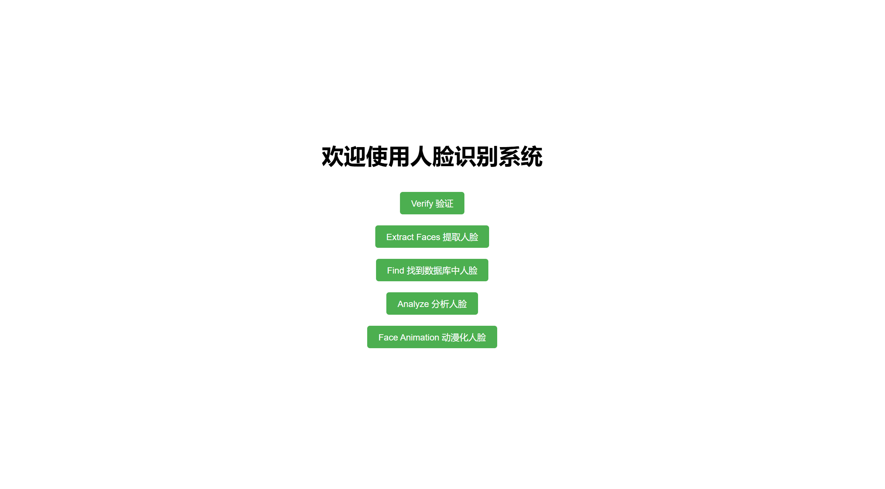
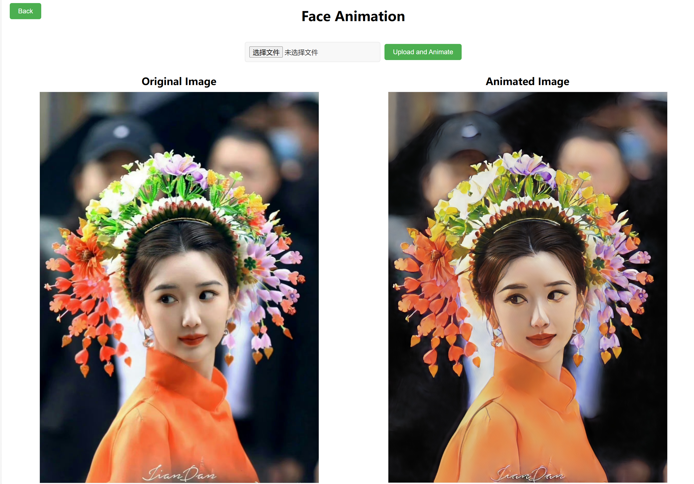

# CV_project

## Introduction
This is a Final project of 2024 spring CS308(Computer Vision) course. Our project leverages the Flask framework for the backend and utilizes HTML for the frontend. It primarily implements four core functionalities of DeepFace: verification, searching, face extraction, and analysis, with an additional creative feature of converting faces into a cartoon style.

## Environment
You can run the following command to import the required environment by pip:
```
cd deepface
pip install -e .
cd ..
cd animegan2
pip install -r requirements.txt
```

## Set up
You can run the project by the following command:
```
python app.py
```
Then you will enter the main page, where you can choose the functions you want to use.


This is the function animation function

Click the "Select File" button to choose the image you want to use, and click the "Upload and Animation" button to generate a cartoon face.



Other functions have similar usage.
